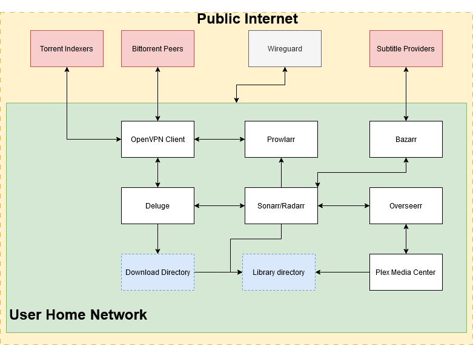

## Quick Arr Stack with Portainer

TV shows and movies downloaded, sorted, with the desired quality and subtitles, behind a VPN (optional), ready to watch, in a beautiful media player.
All automated.

On top of the original configurations added information related to the PureVPN configurations and added a wireguard docker to access the content of the media center outside the home network without the need to open the Plex port.


_Disclaimer: I'm not encouraging/supporting piracy, this is for information only._

## Table of Contents

- [Quick Arr Stack](#quick-arr-stack)
  - [Table of Contents](#table-of-contents)
  - [Overview](#overview)
  - [Hardware configuration](#hardware-configuration)
  - [Software stack](#software-stack)
  - [Installation guide](#installation-guide)
    - [Install docker and docker-compose](#install-docker-and-docker-compose)
    - [Helpful Docker Commands](#helpfull-docker-commands)
    - [Folder Setup](#creating-folder-structure)
    - [Setup Portainer](#install-portainer)
    - [Setup a VPN Container](#configure-vpn)
    - [Setup Deluge](#deluge-configuration)
    - [Setup Plex](#plex-configuration)
    - [Setup Sonarr](#sonarr-configuration)
    - [Setup Radarr](#radarr-configuration)
    - [Setup Prowlarr](#prowlarr-configuration)
    - [Bazarr Configuration](#bazarr-configuration)
    - [Testing](#testing)
    - [Optional containers](#optional-or-alternative-containers)
      - [Setup Wireguard](#setup-wireguard)
        - [Docker container](#wireguard-docker-container)
        - [Configuration and usage](#wireguard-configuration)
      - [Setup Overseerr](#overseerr-setup)
        - [Docker container](#overseerr-docker-container)
        - [Configuration and usage](#overseerr-configuration)
      - [Setup Jelleyfin](#jellyfin-container)
      - [Setup jellyseerr](#jellyseer-container)
  - [Mobile Management](#mobile-management)

## Overview

This is a quick guide on how to build a server with a [Servarr stack](https://wiki.servarr.com/)

How does it work?

This is composed of multiple tools working together to have an automated way to monitor and watch your favorite TV Shows and Movies

**Docker Container Manager**

- [Portainer](https://github.com/portainer/portainer): This is a lightweight service that allows us to deploy, troubleshoot and monitor all of our containers, we can see the status, logs and manage them directly there.

**Downloaders**:

- [OpenVPN Client](https://github.com/dperson/openvpn-client) (optional but highly recommended): the container is used by Deluge to encapsulate the incoming/outgoing traffic.
- [Deluge](http://deluge-torrent.org/) handles torrent download.
- [Prowlarr](https://prowlarr.com/): is an indexer manager/proxy built on the popular *arr .net/reactjs base stack to integrate with your various PVR apps. Prowlarr supports the management of both Torrent Trackers and Usenet Indexers.
- [Bazarr](https://www.bazarr.media/) is a companion application to Sonarr and Radarr. It manages and downloads subtitles based on your requirements. You define your preferences by TV show or movie and Bazarr takes care of everything for you.

**Download orchestration**:

- [Sonarr](https://sonarr.tv): manage TV show, automatic downloads, sort & rename
- [Radarr](https://radarr.video): basically the same as Sonarr, but for movies

**Media Center**:

- [Plex](https://plex.tv): media center server with streaming transcoding features, useful plugins and a beautiful UI. Clients available for many systems (Linux/OSX/Windows, Web, Android, Chromecast, Android TV, etc.)
  - OR
- [Jellyfin](https://jellyfin.org): Jellyfin is the volunteer-built media solution that puts you in control of your media. Stream to any device from your own server, with no strings attached.

**Optional**:

- [Overseerr](https://overseerr.dev/):  is a free and open source software application for managing requests for your media library. It integrates with your existing services, such as Sonarr, Radarr, and Plex!
  - OR
- [Jellyseerr](https://overseerr.dev/):  Overseer is for plex where as Jellyseerr is for Jellyfin.

- [Wireguard](https://github.com/linuxserver/docker-wireguard): is an extremely simple yet fast and modern VPN that utilizes state-of-the-art cryptography. This will allow us to connect to our home network  from anywhere and use the Plex app outside of our house without using Plex servers for routing.


## Hardware configuration

You can use an old Laptop with Debian, Raspberry Pi, a Synology NAS, or a Windows or Mac computer. The stack should work fine on all these systems, but you must adapt the Docker stack below to your OS. I'll only focus on a standard Linux installation here.

Keep in mind that all the movies and shows are downloaded to your computer, so a Hard Drive with high capacity is recommended.

## Software stack



## Installation guide

### Install docker and docker-compose

See the [official instructions](https://docs.docker.com/engine/installation/linux/docker-ce/ubuntu/#install-docker-ce-1) to install Docker.

Then add yourself to the `docker` group:
`sudo usermod -aG docker myuser`

Make sure it works fine:
`docker run hello-world`

Also, install docker-compose (see the [official instructions](https://docs.docker.com/compose/install/#install-compose)).

### Helpfull Docker Commands

```sh
#Check the Status of all docker containers:
docker container ls --format "{{.Names}} || state {{.State}} {{.Status}} || ID {{.ID}}"

#Restart a specific container:
docker-compose restart CONTAINER_NAME

#To follow container logs:
docker-compose logs -f CONTAINER_NAME

#To update all containers:
docker-compose stop
docker-compose pull
docker-compose start

```
#### Creating Folder Structure

Currently, I'm doing this in this way as it is(from what I found) the most straightforward method to have the [Hard link](https://en.wikipedia.org/wiki/Hard_link) for files to work without issues, this halves the amount of size while the torrent is seeding, and solve some access issues that I found while doing this setup.

_Note: ${ROOT} can be any of your own path such as /home/user._

```
${ROOT}/
│
└── MediaCenter/
    │
    ├── quick-arr-stack/
    │   │
    │   └── docker/
    │       │
    │       └── {container-name}/
    │           │
    │           └── config/
    │
    └── MediaCenterBox/
        │
        └── completed/
            │
            ├── movies/
            │
            └── tv/
```

Create the folders needed to store container config and movies/tv show files.

`sudo mkdir -p ${ROOT}/MediaCenter/quick-arr-stack/docker/`

and

`sudo mkdir -p ${ROOT}/MediaCenter/MediaCenterBox/completed/movies`

and

`sudo mkdir -p ${ROOT}/MediaCenter/MediaCenterBox/completed/tv`

Then run the following ones:

`sudo chown -R $USER:$USER ${ROOT}/MediaCenter/quick-arr-stack/docker`
 
and
 
`sudo chown -R $USER:$USER ${ROOT}/MediaCenter/MediaCenterBox`
 
This will allow you to create folders, copy and paste files, this could be also required for Sonarr and Radarr to do some operations.

### Install Portainer


```sh
docker run -d -p 8000:8000 -p 9443:9443 --name portainer --restart=always -v /var/run/docker.sock:/var/run/docker.sock -v ${ROOT}/MediaCenter/quick-arr-stack/docker/portainer/data:/data portainer/portainer-ce:latest
```

See the [official instructions](https://docs.portainer.io/start/install-ce/server/docker/linux) for Initial Setup Portainer. or watch video (https://youtu.be/4y0ksWu4wHw?si=sz1FxeFxhQZsKc09&t=301)

### Portainer Configuration


The Web UI for Portainer will be available on port 9000. Load it up and you will be greeted with the admin creation page.
Add an username and password and hit `Create User`


### Prepare template for Portainer

- Download the `quick-arr-docker.yml` from this repo.
- Open it in your fav editor like notepad++
- Replace all occurrences of `${ROOT}` with your path.
- Change `10.0.0.0/24` CIDR under openvpn service with your host machine cidr.

### Setup template in Portainer

- Login into Portainer
- From the menu select App Templates then select Custom Templates.
- Click Add Custom Template then complete the details
- Copy paste the modified content of `quick-arr-docker.yml` in the Web editor.
- Update the template
- Do not Deploy the Stack now. Follow (#Configure-VPN-with-your-openvpn-files)

***

## Configure VPN

Configure vpn with your openvpn files.

- Download openvpn files from your vpn provider.
- Delete all content in `${ROOT}/MediaCenter/quick-arr-stack/docker/openvpn/config/vpn` (if exists).
  - download sample vpn.conf and vpn.auth from repo `conf\vpn` and place under `${ROOT}/MediaCenter/quick-arr-stack/docker/openvpn/config/vpn`.
  - copy the udp/country.ovpn file content from your vpn provider to vpn.conf
  - edit and set vpn username and password in vpn.auth


### Deploy the template in Portainer

As the config for VPN is now complete, Login into portainer and go to App Templates -> Custom Templates and deploy the template.

***


#### Deluge Configuration

_Note_: If the bellow page does not open and you are using the VPN normally it means that something is wrong with the VPN itself!


You should be able to log in on the web UI (`localhost:8112`, replace `localhost` with your machine ip if needed).

The default password is `deluge`. You are asked to modify it.


The running deluge daemon should be automatically detected and appear online, you can connect to it.


You should activate `autoadd` and `Label` in the plugins section: it adds support for `.magnet` files and labels in Sonarr and Radarr.


Configuration gets stored automatically in your mounted volume (`${ROOT}/MediaCenter/quick-arr-stack/docker/deluge-openvpn/config`) to be re-used at container restart.

Important files in there:

- `auth` contains your login/password
- `core.conf` contains your deluge configuration

You can use the Web UI manually to download any torrent from a .torrent file or magnet hash.


Notice how Deluge is now using the VPN container network, with Deluge web UI and Prowlarr port exposed on the vpn container for local network access.

#### Verify vpn connection

Login into portainer and go to Containers -> click deluge -> Click Console -> Connect


Once connected run `curl ipinfo.io` and verify the output.


***

#### Plex Configuration

Plex Web UI should be available at `localhost:32400/web` (replace `localhost` by your server ip if needed).
You'll have to log in first (registration is free), and then Plex will ask you to add your libraries.
I have two libraries:

- Movies
- TV shows

Add these the library paths:

- Movies: `${ROOT}/MediaCenter/MediaCenterBox/completed/movies`
- TV: `${ROOT}/MediaCenter/MediaCenterBox/completed/tv`

Example:


As you'll see later, these library directories will each have files automatically placed into them with Radarr (movies) and Sonarr (tv), respectively.

Now, Plex will then scan your files and gather extra content; it may take some time according to how large your directory is.

A few things I like to configure in the settings:

- Tick "Update my library automatically"

You can already watch your stuff through the Web UI.

***


#### Sonarr Configuration


Sonarr should be available on `localhost:8989`. Setup login and reload the page and then go straight to the `Settings` tab.


Sonarr should be ready out of the box, there are multiple settings and configurations that you can explore later but we are going to start with the basics.

`Root Folders` is in the Media Management tab, here we add the `/MediaCenterBox/completed/tv/` folder. This will be the default directory where all the TV Shows will be stored


`Download Clients` tab is where we'll configure links with our download client Deluge.
There are existing presets for these 2 that we'll fill with the proper configuration.

Deluge configuration:


Enable `Advanced Settings`, and tick `Remove Completed` in the Completed Download Handling section. This tells Sonarr to remove torrents from Deluge once processed.


`Indexers` is the important tab: that's where Sonarr will grab information about released episodes. This will be automatically configured by [Prowlarr](#setup-prowlarr) later when setting prowlarr. No need to add indexer at this point.


In `Connect` tab, we'll configure Sonarr to send notifications to Plex when a new episode is ready:


#### Radarr Configuration

Radarr is a fork of Sonarr, made for movies instead of TV shows.

Radarr should be available on `localhost:7878`. Setup login and reload the page and then go straight to the `Settings` tab.

Radarr should be ready out of the box, there are multiple settings and configurations that you can explore later but we are going to start with the basics.

`Root Folders` is in the Media Management tab, here we add the `/MediaCenterBox/completed/movies/` folder. This will be the default directory where all the TV Shows will be stored


`Download Clients` tab is where we'll configure links with our download client Deluge.
There are existing presets for these 2 that we'll fill with the proper configuration.

Deluge configuration:


Enable `Advanced Settings`, and tick `Remove Completed` in the Completed Download Handling section. This tells Sonarr to remove torrents from Deluge once processed.


`Indexers` is the important tab: that's where Radarr will grab information about released episodes. This will be automatically configured by [Prowlarr](#setup-prowlarr) later when setting prowlarr. No need to add indexer at this point.


In `Connect` tab, we'll configure Sonarr to send notifications to Plex when a new episode is ready:


***

#### Prowlarr Configuration

Prowlarr web UI is available on port 9696(`localhost:9696`, replace `localhost` by your machine ip if needed).


Setup login and reload the page and then go straight to the `Settings` tab.


Click on `Add Indexer` and add any torrent indexer that you like. I added 1337x as an example.


Click on `Apps` and add the Sonarr and Radarr App, this will require an API key that you can get in the Radarr and Sonarr apps in the `Settings - General` and then `Security`


Do the Same for the Sonarr app and click on the `Sync App Indexers` button 


Now on Sonar and Radarr in the Settings - Indexers Tab it will show the indexer added in Prowlarr


***


#### Bazarr Configuration

The Web UI for Bazarr will be available on port 6767. Load it up and you will be greeted with this setup page:

You can skip this page and go to the `Languages` tab. Here is an example I'm setting 2 languages to be fetch, English and Portuguese


Now we are going to create a profile that will define the type of subtitles that we want.


At last, we are going to set this profile as default for Movies and TV shows at the bottom of the page.


Hit Save on the top of the page and move to the next step.


Now go to the `Providers` tab. Here you can add all the providers that you choose from the provided list, for not I will use  [Open Subtitles](https://www.opensubtitles.org/). If you don't have an account head on over to the [Registration page](https://www.opensubtitles.org/en/newuser) and make a new account. 


Hit Save on the top of the page and move to the next step.

Now we are going to enable the Sonarr and Radarr integrations. Go to the Sonarr tab and hit the enabled toggle.
Here we need to change the address to the `IP` otherwise Bazarr will not detect, change the IP address of your machine, in my example is the `192.168.0.144`, and set the Sonarr API key as we have done during the [Prowlarr configuration](#prowlarr-configuration) then hit test.


Hit Save on the top of the page and move to the Radarr Tab, do the same steps as above but using the Radarr API key, then hit Save on the top of the page and move to the next step.

After these steps you should see two new tabs, `Series` and `Movies`, this will be here where all the movies and tv shows are listed and the subtitles status of them. 


After this, all the required configurations are done and everything should work.


#### Testing

Go to Radarr to the `Movies` tab and click on `Add New`, search for a Movie, I'm going to use `The Last Man on Earth (1964)` as is a Public Domain Movie.
This will automatically fill in all the required information. You can adapt these parameters as you see fit. Make sure that you define a `Monitor` type so the movie is automatically downloaded


Now if you click on `Movies` tab the added movie will display with a colour showing the current status of it, and some seconds after it should automatically start to download.


Is also possible to manually search and many other options but that is beyond the scope of this guide.


When the download is over, you can head over to Plex and check if the movie appeared correctly, with all metadata and subtitles grabbed automatically. 


#### Optional or Alternative containers

The following containers are nice to have and are not required for the "mediaBox experience", these can be added or replaced from the `quick-arr-docker.yml` without any impact for all the system.

For example, jellyfin can be used an alternative to plex and jelleyseer instead of overseer.

## Overseerr Setup

We'll use Overseerr [official Docker image](https://hub.docker.com/r/sctx/overseerr)
Overseerr is a request management and media discovery tool built to work with your existing Plex ecosystem.
Overseerr helps you find media you want to watch. With inline recommendations and suggestions.

It will allow you to request Movies and TV Shows without the need to go to Radarr or Sonarr, this is really helpful when there are other users in the system that we do want to give access to Sonarr or Radarr for them to request movies.


#### Overseerr Configuration

The Web UI for Overseerr will be available on port 5055. Load it up and you will be greeted with this setup page:


You will need to log in with your Plex account.

In the following screen fill the requested information

Server: Manual Configuration
Hostname or IP Address: your Plex Docker container IP
Port: your Plex Docker container port

Select the Libraries that you want to scan and hit Start Scan


Radarr and Sonarr Setup
in the following screen configure the both Radarr and Sonarr


for each, we need to define it as the default server set the IP address (the port should be the default one) and the API Key, then click on test.
after that fill the remaining settings with your desired configuration.


### Setup Wireguard
We'll use [WireGuard Easy](https://github.com/wg-easy/wg-easy) i.e. easiest way to install & manage WireGuard on any Linux host!
This container will allow you to connect to all your services outside your home network exposing only one port

_Note_: It's required to open port 51820 in your router to be abbe to connect with the VPN to your home network.

The following website has some example of how to port forward for most of routers: [portforward.com](https://portforward.com/router.htm)

#### Wireguard Docker container

```yaml
version: "3.8"
services:
  wg-easy:
    environment:
      - LANG=en
      - WG_HOST=<publicIP>
      - PASSWORD=<webUiPass>
      - WG_PORT=51820
      - WG_ALLOWED_IPS=10.0.0.0/24
      - UI_TRAFFIC_STATS=true
      - UI_CHART_TYPE=1

    image: ghcr.io/wg-easy/wg-easy
    container_name: wg-easy
    volumes:
      - ${ROOT}/MediaCenter/quick-arr-stack/docker/wireguard:/etc/wireguard
    ports:
      - "51820:51820/udp"
      - "51821:51821/tcp"
    restart: unless-stopped
    cap_add:
      - NET_ADMIN
      - SYS_MODULE
    sysctls:
      - net.ipv4.ip_forward=1
      - net.ipv4.conf.all.src_valid_mark=1
```


#### Wireguard Configuration

The Web UI will now be available on http://0.0.0.0:51821

***

## Jellyfin Container

Use this as an alternative to Plex along with jellyseer.

```yaml
  jellyfin:
    image: jellyfin/jellyfin
    container_name: jellyfin
    environment:
      - PUID=1000
      - PGID=1000
      - UMASK=002
      - TZ=America/Toronto
    volumes:
      - ${ROOT}/MediaCenter/quick-arr-stack/docker/jellyfin/config:/config
      - ${ROOT}/MediaCenter/MediaCenterBox/completed:/data
    ports:
      - "8096:8096"
    restart: unless-stopped
```

## Jellyseer Container

```yaml
 jellyseerr:
    image: fallenbagel/jellyseerr:latest
    container_name: jellyseerr
    environment:
      - PUID=13006
      - PGID=13000
      - UMASK=002
      - LOG_LEVEL=debug
      - TZ=America/Toronto
    ports:
      - "5055:5055"
    volumes:
      - ${ROOT}/MediaCenter/quick-arr-stack/docker/jellyseerr/config:/app/config
    restart: unless-stopped
```

### Flood UI

Use this beautiful web UI for various torrent clients as an alternative to default deluge webui.

```yaml
  flood:
    container_name: flood
    user: 1000:1001
    image: jesec/flood:master
    restart: unless-stopped
    command: --port 3001 --allowedpath /data
    environment:
        HOME: /config
    volumes:
        - ${ROOT}/MediaCenter/quick-arr-stack/docker//flood/config:/config
        - ${ROOT}/MediaCenter/MediaCenterBox:/data
    network_mode: 'service:openvpn'
    depends_on:
      - openvpn
```
### Flood UI Config:
Use default host, user, and port i.e localhost, localclient, 58846 and your deluge password to add client to Flood.


## Mobile Management

[Lunasea](https://www.lunasea.app/), Open source manager

[nzb360](http://nzb360.com), is more powerful than lunasea  with a free and paid version. 

_Note_: This only work inside your home network.
